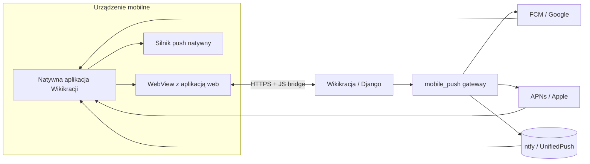

# Natywna aplikacja mobilna Wikikracji — projekt

## 1. Cel i ograniczenia projektowe

Stworzyć **natywną aplikację na Androida i iOS**, którą można instalować ze sklepu (Play / App Store / F-Droid).

- **Nie przepisujemy UI.** Aplikacja wyświetla istniejącą, responsywną wersję webową w natywnym `WebView`. Wszystkie funkcje (głosowania, obywatele, czat, dokumenty, finanse, kalendarz, ustawienia) działają od razu przez stronę `https://<instancja>`.
- **Mobilna aplikacja to tylko warstwa prezentacji.** Cała logika pozostaje w Django. Natywny kod służy do:
  - obsługi powiadomień push,
  - głębokich linków,
  - drobnych poprawek mobilnych (pasek stanu, obszar kamery, przycisk wstecz, splash).
- **Własny serwer powiadomień i własny gateway push.** Backend Wikikracji sam decyduje, kiedy i komu wysłać powiadomienie, a własny gateway dispatchuje je do konkretnego providera (FCM, APNs, ewentualnie ntfy/UnifiedPush). Provider ostatniej mili (Google / Apple / własny ntfy) pozostaje z konieczności — patrz sekcja o prywatności.

Dokument ten zakłada, że obowiązują dotychczasowe reguły architektoniczne: prosta, monolityczna aplikacja Django, minimalna liczba warstw, nie powielamy logiki, szanujemy separację backend/frontend.

---

## 2. Architektura ogólna



---

## 3. Aplikacja mobilna (kliencka)

### 3.1. Rekomendowany stack — Capacitor

Zalecamy **Ionic Capacitor** jako obudowę WebView:

- jeden projekt generuje natywne projekty Android (Gradle) i iOS (Xcode),
- minimalna ilość natywnego kodu (Kotlin/Swift) — większość logiki zostaje w aplikacji webowej,
- gotowe pluginy do push, status bar, splash, deep links,
- można ładować aplikację z zewnętrznego URL-a (`server.url` w `capacitor.config.ts`).

Alternatywy (dla porównania):

- **Natywny WebView w Kotlin/Swift** — więcej kodu, dwa osobne projekty, większa kontrola.
- **Flutter + webview** — dobry, ale wymaga nauki Fluttera; niepotrzebny, skoro cały UI jest webowy.
- **React Native + react-native-webview** — możliwy, ale wymaga ekosystemu RN.
- **TWA (Trusted Web Activity)** — opakowanie PWA bez natywnego kodu; nie da się dodać własnego push poza Web Push przeglądarki.

### 3.2. Ładowanie aplikacji webowej

`capacitor.config.ts` (przykład dla jednej grupy):

```ts
import { CapacitorConfig } from '@capacitor/cli';

const config: CapacitorConfig = {
  appId: 'pl.wikikracja.app',   // bundle ID / application ID
  appName: 'Wikikracja',
  webDir: 'dist',               // może być pusty loader
  server: {
    url: 'https://moja-grupa.wikikracja.pl',
    cleartext: false,
    allowNavigation: ['moja-grupa.wikikracja.pl'],
  },
  plugins: {
    PushNotifications: {
      presentationOptions: ['badge', 'sound', 'alert'],
    },
  },
};

export default config;
```

Dla wielu grup (aplikacja generyczna):

1. Na pierwszym ekranie użytkownik wpisuje URL grupy.
2. URL zapisywany jest w natywnym storage (`Preferences`).
3. WebView ładuje ten URL (`window.location.href = url` lub `Capacitor.Plugins.App.openUrl` — decyzja do przetestowania).

Decyzja do podjęcia: **aplikacja na zamówienie per grupa** (prostsza, branding, stały URL) czy **jedna aplikacja generyczna** (drobniejszy kod native, ale wymaga ekranu konfiguracji i więcej logiki testowej).

### 3.3. JS bridge między natywną aplikacją a webem

Aplikacja webowa musi umieć porozumiewać się z natywnym push. Rekomendowane podejście:

- Backend serwuje `home/static/home/js/mobile-bridge.js`, który dołącza się do `base.html` (warunkowo lub zawsze — do ustalenia).
- Skrypt tworzy globalny obiekt `window.WikikracjaMobile`.
- W przeglądarce zwykłej obiekt ten robi niewiele; w aplikacji Capacitor korzysta z natywnych pluginów.

Przykładowe API mostka:

```js
window.WikikracjaMobile = {
  isNativeApp: () => true,                    // w przeglądarce false
  getPushToken: async () => { ... },          // zwraca token / endpoint push
  requestPushPermission: async () => { ... }, // prosi o zgodę
  openExternal: (url) => { ... },             // otwiera zewnętrzny link
  setStatusBar: (style) => { ... },           // dark / light
  share: (text, url) => { ... },
};
```

Mechanizm jest analogiczny do obecnej rejestracji FCM: web wywołuje `getPushToken()`, dostaje token i wysyła `POST` na backendowy endpoint rejestracji.

W kontekście aplikacji natywnej **nie inicjalizujemy Firebase Web SDK** ani `firebase-messaging-sw.js`. Webowa ścieżka `push-notifications.js` powinna rozpoznawać obecność `WikikracjaMobile.isNativeApp()` i w takim wypadku wyłączać `initFCM()`, przekazując sterowanie do mostka.

### 3.4. Natywne powiadomienia push

Do obsługi push używamy `@capacitor/push-notifications`:

- **Android:** plugin korzysta z FCM. Wymaga `google-services.json` w projekcie Android oraz pakietu `@capacitor/push-notifications` skonfigurowanego z FCM.
- **iOS:** plugin korzysta z APNs. Wymaga certyfikatu / klucza APNs, App ID z powiadomieniami i odpowiednich uprawnień w Xcode.
- **Przyszłość (Android bez Google):** można dodać wsparcie dla **UnifiedPush** poprzez dedykowany plugin / bibliotekę, która rejestruje się u dystrybutora (np. ntfy) i zwraca endpoint URL zamiast tokena FCM.

Przepływ rejestracji:

1. Aplikacja natywna prosi o uprawnienia (`PushNotifications.requestPermissions()`).
2. Po zgodzie rejestruje się (`PushNotifications.register()`).
3. Odbiera zdarzenie `pushNotificationToken` z tokenem.
4. Wywołuje `window.WikikracjaMobile.getPushToken()` lub bezpośrednio `fetch('/mobile/push/register/', ...)`.
5. Backend zapisuje token w modelu `MobileDevice` i przypisuje do użytkownika.

Obsługa przychodzących powiadomień:

- `pushNotificationReceived` (foreground) — można przekazać do WebView, by aplikacja webowa sama obsłużyła powiadomienie.
- `pushNotificationActionPerformed` (kliknięcie) — otwiera głęboki link (`/chat?room=123`, `/events/5/` itp.) w WebView.

### 3.5. Minimalne poprawki mobilne

- **Splash screen** — podczas ładowania strony.
- **Status bar / safe area** — wykorzystanie `env(safe-area-inset-*)` w CSS; klasa `.is-native-app` na `<html>` dla drobnych korekt.
- **Przycisk wstecz na Androidzie** — obsługa historii WebView; jeśli WebView może wrócić, to wraca, w przeciwnym razie pyta o zamknięcie.
- **Pull-to-refresh** — opcjonalnie; można zostawić odświeżanie w aplikacji webowej.
- **Offline / brak połączenia** — prosta natywna strona błędu z przyciskiem "spróbuj ponownie".

### 3.6. Dystrybucja

| Ścieżka | Format | Uwagi |
|---|---|---|
| Google Play | Android App Bundle (`.aab`) | Wymaga FCM; najłatwiejsza droga dla użytkowników. |
| F-Droid | `.apk` | Możliwa wersja bez FCM z UnifiedPush/ntfy. |
| App Store | `.ipa` | Wymaga Apple Developer, APNs, review. |
| Obejście sklepów | APK/IPA side-load | Tylko dla zaawansowanych użytkowników / testy. |

---

## 4. Serwer powiadomień i push gateway (backend)

### 4.1. Słownik

- **Serwer powiadomień** — logika w Django, która decyduje o wysyłce (np. `zzz/notifications.py`, `chat/services.py`).
- **Push gateway** — warstwa abstrakcji w Django (`mobile_push/gateway.py`), która przyjmuje powiadomienie i wysyła je do konkretnego providera push.
- **Provider ostatniej mili** — usługa, która fizycznie dostarcza powiadomienie do urządzenia: FCM (Google), APNs (Apple), ntfy/UnifiedPush (własny lub wspólnotowy).

### 4.2. Nowa aplikacja Django: `mobile_push`

Nowa aplikacja w repo, podobnie jak istniejące `chat`, `glosowania` itp. Nie miesza się z obecnym `push-notifications` / `GCMDevice` (PWA), dopóki nie zdecydujemy się na konsolidację.

#### 4.2.1. Model urządzenia

```python
# mobile_push/models.py
from django.conf import settings


class MobileDevice(models.Model):
    PROVIDERS = [('fcm', 'FCM (Android / web)'), ('apns', 'APNs (iOS)'), ('ntfy', 'ntfy / UnifiedPush')]
    PLATFORMS = [('android', 'Android'), ('ios', 'iOS')]

    user = models.ForeignKey(settings.AUTH_USER_MODEL, on_delete=models.CASCADE, related_name='mobile_devices')
    provider = models.CharField(max_length=20, choices=PROVIDERS)
    token = models.TextField()  # FCM token, APNs hex token lub UnifiedPush endpoint URL
    platform = models.CharField(max_length=20, choices=PLATFORMS)
    device_type = models.CharField(max_length=20, blank=True)  # mobile / tablet
    display_mode = models.CharField(max_length=20, blank=True)  # app
    active = models.BooleanField(default=True)
    created_at = models.DateTimeField(auto_now_add=True)
    updated_at = models.DateTimeField(auto_now=True)

    class Meta:
        constraints = [models.UniqueConstraint(fields=['provider', 'token'], name='unique_mobile_provider_token')]
```

Logika deduplikacji (token należy do jednego użytkownika, analogicznie do `chat/push_api.py`):

```python
MobileDevice.objects.filter(token=token, provider=provider).exclude(user=user).delete()
```

#### 4.2.2. Gateway — abstrakcja providerów

```python
# mobile_push/gateway.py
import abc
from typing import List


class PushProvider(abc.ABC):
    name: str

    @abc.abstractmethod
    def send(self, devices: List[MobileDevice], title, body, data=None, badge=None, sound=None, image=None, click_action=None) -> dict:
        """Wysyła powiadomienie do listy urządzeń. Zwraca podsumowanie wyników."""


class FCMProvider(PushProvider):
    name = 'fcm'
    # używa firebase_admin.messaging (już obecne w zzz/notifications.py)


class APNSProvider(PushProvider):
    name = 'apns'
    # używa aioapns lub apns2; wymaga klucza/certyfikatu APNs


class NtfyProvider(PushProvider):
    name = 'ntfy'
    # POST na endpoint zapisany w device.token


class MobilePushGateway:
    def __init__(self):
        self.providers = {p.name: p for p in [FCMProvider(), APNSProvider(), NtfyProvider()]}

    def send_to_user(self, user, notification: dict):
        devices = MobileDevice.objects.filter(user=user, active=True)
        by_provider = {}
        for d in devices:
            by_provider.setdefault(d.provider, []).append(d)

        for provider_name, devs in by_provider.items():
            provider = self.providers.get(provider_name)
            if provider:
                provider.send(
                    devs,
                    title=notification['title'],
                    body=notification['body'],
                    data={
                        'notification_id': notification.get('notification_id'),
                        'room_id': notification.get('room_id'),
                        'event_id': notification.get('event_id'),
                        'click_action': notification.get('click_action'),
                    },
                    click_action=notification.get('click_action'),
                )
```

Powyższa klasa jest jedynym miejscem, w którym backend wie o providerach. Reszta aplikacji woła `MobilePushGateway.send_to_user(user, notification)`.

#### 4.2.3. Endpointy API

- `POST /mobile/push/register/` — rejestruje / aktualizuje urządzenie.
- `POST /mobile/push/unregister/` — dezaktywuje urządzenie.
- `POST /mobile/push/ack/` — potwierdzenie dostarczenia / kliknięcia (może korzystać z istniejącego `chat/push_api.py::PushNotificationAckView` lub być osobnym widokiem bez CSRF, bo woła go service worker / natywny kod).

Przykładowy payload rejestracji:

```json
{
  "provider": "fcm",
  "token": "...",
  "platform": "android",
  "device_type": "mobile",
  "display_mode": "app"
}
```

#### 4.2.4. Integracja z istniejącym systemem powiadomień

Obecnie `zzz/notifications.py` buduje powiadomienie i wysyła przez FCM / WebSocket / e-mail. Należy dodać trzeci kanał:

```python
# zzz/notifications.py
from mobile_push.gateway import get_mobile_push_gateway


def send_notification_to_user(user, notification, notification_type=None):
    ...
    send_fcm_to_user_sync(user, notification, notification_type)  # PWA
    send_websocket_to_user(user, notification, ws_type='notification')  # otwarta karta
    if settings.MOBILE_PUSH_ENABLED:
        get_mobile_push_gateway().send_to_user(user, notification)  # aplikacja natywna
```

Lepiej: wykorzystać istniejący `build_notification()` (z `notification_id`, `title`, `body`, `click_action`, `room_id`, `event_id` itp.) i przekazać go do gatewaya — unikamy duplikowania formatu powiadomień.

### 4.3. Providerzy i co widzą

| Platforma | Provider | Co widzi provider | Wymagania konfiguracyjne |
|---|---|---|---|
| Android (Play) | FCM (Google) | Token, IP, payload, metadane | `google-services.json`, klucz service account (`FIREBASE_CERT_PATH`), obecne `firebase_admin` |
| iOS | APNs (Apple) | Device token, payload, IP | Klucz APNs (`.p8`) lub certyfikat, Bundle ID, App ID z powiadomieniami |
| Android (no-Google) | ntfy / UnifiedPush | Endpoint URL, IP, payload | Serwer ntfy (self-hosted lub publiczny), dystrybutor na telefonie |

**Nie da się całkowicie usunąć providera ostatniej mili.** iOS wymaga APNs. Android w sklepie Play praktycznie wymaga FCM. Android poza Google może użyć UnifiedPush/ntfy, ale wtedy użytkownik musi mieć dystrybutora i często sam zainstalować aplikację z F-Droid.

Własny gateway **ogranicza** wyciek: to serwer Wikikracji (a nie każdy klient osobno) łączy się z FCM/APNs/ntfy, więc provider widzi **IP serwera** i metadane push, a nie IP każdego użytkownika. To znaczna poprawa prywatności względem obecnej sytuacji, w której każda przeglądarka pobiera JS z `gstatic.com` i łączy się z FCM.

### 4.4. Przepływ wysyłki powiadomienia (przykład: nowa wiadomość w czacie)

1. Użytkownik wysyła wiadomość → `ChatConsumer` / `chat/services.py`.
2. Wołany jest `build_notification(...)` z `notification_id`, `title`, `body`, `room_id`, `click_action`.
3. `zzz/notifications.py` dystrybuuje:
   - WebSocket do otwartych kart,
   - FCM do PWA (`GCMDevice`),
   - `MobilePushGateway.send_to_user()` do aplikacji natywnych.
4. Gateway wybiera providera (`fcm`, `apns`, `ntfy`) na podstawie `MobileDevice.provider`.
5. Provider wysyła do urządzenia.
6. Aplikacja natywna odbiera push, wyświetla natywną notyfikację i/lub przekazuje do WebView.
7. Użytkownik klika powiadomienie → aplikacja otwiera odpowiedni URL w WebView.
8. Aplikacja (lub WebView) wysyła ack na `/mobile/push/ack/` lub `/chat/api/push/ack/`.

### 4.5. Obsługa martwych tokenów

Podobnie jak w `POWIADOMIENIA.md` dla FCM, gateway musi dezaktywować urządzenia przy błędach:

- FCM: `UnregisteredError`, `SenderIdMismatch`, `InvalidArgument`.
- APNs: `Unregistered`, `BadDeviceToken`.
- ntfy/UnifiedPush: HTTP 4xx na endpoint.

Powinno to być zaimplementowane wewnątrz `FCMProvider.send()`, `APNSProvider.send()`, `NtfyProvider.send()`.

### 4.6. Payload i deep links

Wspólny format `data` dla wszystkich providerów:

```json
{
  "title": "...",
  "body": "...",
  "notification_id": "uuid",
  "room_id": 123,
  "event_id": null,
  "click_action": "/chat?room=123",
  "tag": "chat-123",
  "icon": "/favicon.ico",
  "badge": "/favicon.ico"
}
```

- **FCM** wysyła `notification` + `data` + `webpush.*` (dla spójności z PWA).
- **APNs** wysyła `aps.alert`, `aps.badge`, `aps.sound` oraz `wikikracja` (custom) z tymi samymi polami.
- **ntfy** wysyła `title`, `message`, `click` (URL), `priority`, `tags`.

Aplikacja natywna po otwarciu `click_action` ustawia `WebView.src = 'https://<instancja>/chat?room=123'` i ewentualnie czyści query-string z powiadomienia.

---

## 5. Bezpieczeństwo i prywatność

- **HTTPS zawsze.** Capacitor na iOS domyślnie blokuje cleartext (`cleartext: false`).
- **Cert pinning (opcjonalnie).** Można przypiąć certyfikat LE root lub konkretny certyfikat instancji, by zapobiec atakom na publicznych Wi-Fi. Uwaga na rotację certyfikatów.
- **Powiązanie tokena z użytkownikiem.** Token przypisany do `request.user` — nigdy nie przyjmujemy `user_id` z payloadu.
- **Token refresh.** Aplikacja musi rejestrować nowy token przy każdej zmianie (FCM/APNs mogą go odświeżyć). Przy rejestracji usuwamy stary token dla tego użytkownika.
- **Wylogowanie.** Przy wylogowaniu w aplikacji webowej wywoływany jest `/mobile/push/unregister/`, by dezaktywować token.
- **Minimalny payload.** Providerzy ostatniej mili widzą tylko tytuł, treść i click_action. Nie wysyłamy pełnej treści wiadomości, jeśli jest wrażliwa — ale w Wikikracji czat może być otwarty, więc decyzja, czy szyfrować payload, zależy od polityki grupy.
- **Ograniczenie prywatności providera.** Jak wyżej: własny gateway wysyła push do providera, więc provider nie widzi IP użytkownika, ale nadal widzi token urządzenia i metadane. Aby uniknąć FCM/APNs, trzeba porzucić push w tle lub zbudować własny system powiadomień oparty na stałym połączeniu (co jest niemożliwe na iOS i trudne na nowszych Androidach bez uprawnień).

---

## 6. MVP i roadmapa

### Faza 1 — MVP (Android FCM + iOS APNs)

1. Utworzyć projekt Capacitor w `mobile/`.
2. Skonfigurować ładowanie instancji web (najpierw per grupa, stały URL).
3. Dodać plugin push i JS bridge.
4. Utworzyć aplikację Django `mobile_push`:
   - model `MobileDevice`,
   - `FCMProvider` (korzysta z `firebase_admin`),
   - `APNSProvider` (korzysta z `aioapns` / `apns2`),
   - endpointy `/mobile/push/register/`, `/mobile/push/unregister/`, `/mobile/push/ack/`.
5. Zintegrować `MobilePushGateway` z `zzz/notifications.py`.
6. Zmodyfikować `push-notifications.js` / `app.js`, by w trybie natywnym nie ładowały FCM web.
7. Skonfigurować FCM dla Androida i APNs dla iOS.
8. Przetestować powiadomienia w tle i klikanie (deep links).
9. Zbudować `.aab` i `.ipa` i przygotować do sklepu.

### Faza 2 — Poprawki UX i głębokie linki

1. Obsługa przycisku wstecz, splash, status bar, safe area.
2. Universal Links (iOS) i Android App Links (`/.well-known/assetlinks.json`).
3. Generyczna aplikacja z ekranem wpisywania URL grupy.
4. Natywny share i otwieranie załączników.
5. Cache / offline: lokalna strona błędu, retry.

### Faza 3 — Prywatność i skalowanie

1. Wsparcie **UnifiedPush / ntfy** dla Androida bez Google.
2. Wydzielenie push gateway do osobnej usługi (microservice) przy dużej liczbie urządzeń, by nie blokować Django.
3. Rozważenie szyfrowania payloadu powiadomień end-to-end (jeśli grupa ma taką politykę).

---

## 7. Otwarte pytania i decyzje do podjęcia

1. **Aplikacja per grupa czy generyczna?**
   - Per grupa: prostsza, spójny branding, stały URL w buildzie.
   - Generyczna: jedna aplikacja we wszystkich sklepach, użytkownik wpisuje URL grupy. Więcej QA i kodu natywnego.

2. **Czy wersja dla sklepu Play może używać UnifiedPush zamiast FCM?**
   - Technicznie tak, ale użyteczność spada (użytkownik musi mieć dystrybutor). Zalecane: FCM w Play, UnifiedPush w F-Droid.

3. **Czy konsolidować `MobileDevice` z istniejącym `GCMDevice`?**
   - Na początek nie. `GCMDevice` obsługuje PWA/FCM; `MobileDevice` obsługuje wszystkie natywne provider. Później można zunifikować w jeden model `PushDevice`.

4. **Jaką bibliotekę do APNs?**
   - `aioapns` (async, nowoczesna) lub `apns2` (prostsza, sync). Decyzja po sprawdzeniu wsparcia w Pythonie 3.14 i zgodności z `pyproject.toml`.

5. **Czy cert pinning jest wymagany?**
   - Na start nie; HTTPS wystarczy. Do rozważenia w fazie 3 dla grup z wysokimi wymaganiami prywatności.

6. **Czy zachować PWA / Web Push równolegle?**
   - Tak. Aplikacja natywna to dodatkowy kanał, nie zastępstwo PWA. Użytkownik może korzystać z przeglądarki lub z natywnej aplikacji.

---

## 8. Podsumowanie

Projekt zakłada **prosty wrapper natywny** oparty na Capacorze, który ładuje istniejącą aplikację webową i dodaje natywny push. Backend rozszerzamy o nową aplikację `mobile_push` z własnym gatewayem, który rozdziela powiadomienia między providerów (FCM, APNs, ntfy/UnifiedPush). Dzięki temu serwer Wikikracji staje się własnym serwerem powiadomień — to on decyduje o wysyłce i kontaktuje się z providerami, a nie każdy klient osobno.

Własny gateway poprawia prywatność w porównaniu z obecnym FCM web, ale **nie eliminuje całkowicie Google czy Apple** z ostatniej mili. Pełne wyeliminowanie jest możliwe tylko kosztem rezygnacji z niezawodnego pushu w tle (iOS) lub zmuszenia użytkowników do ekosystemu bez Google (F-Droid + UnifiedPush).
